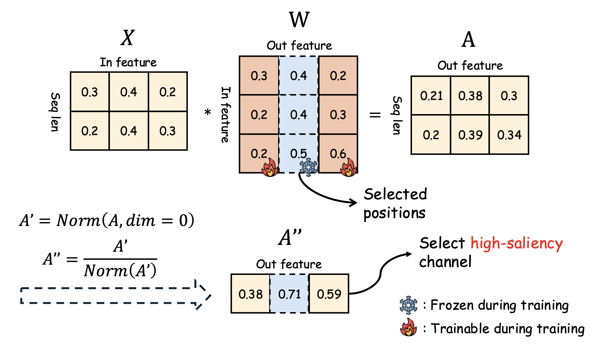

# 🔥 [EMNLP 2026 Main] AWARe: Mitigating Catastrophic Forgetting via Activation-Weighted Adaptive REtention

[](https://creativecommons.org/licenses/by/4.0/)
[](https://www.python.org/downloads/release/python-3100/)

This repository contains the official implementation of the paper **"Activation-Weighted Adaptive REtention (AWARe)"**.

## 📝 Abstract

> Multimodal Large Language Models (MLLMs) exhibit strong generalization and reasoning abilities due to large-scale multimodal pre-training. However, fine-tuning these models on downstream tasks often leads to catastrophic forgetting, where newly learned task-specific knowledge degrades previously acquired capabilities. This issue arises because gradient updates for new tasks overwrite parameters critical to prior knowledge, limiting the practical deployment of MLLMs. To address this challenge, we propose Activation-Weighted Adaptive REtention (AWARe), a fine-tuning method that mitigates catastrophic forgetting by dynamically controlling parameter updates based on activation patterns. AWARe assigns activation-based importance scores to parameters, selectively freezing those essential for preserving prior capabilities while allowing less important parameters to adapt to new tasks. Importantly, AWARe operates without modifying model architectures, ensuring compatibility with existing inference engines. Extensive experiments demonstrate that AWARe effectively preserves upstream capabilities while achieving superior downstream performance compared to existing methods.

<p align="center">
  
</p>

## 🚀 Features

- **Dynamic Parameter Selection**: Adaptive freezing of parameters based on activation importance.
- **Architecture-Agnostic**: No structural changes to the model, ensuring compatibility with standard inference pipelines (e.g., vLLM, HuggingFace).
- **Preserves Generalization**: Effectively maintains upstream capabilities (e.g., VQA, Captioning) while fine-tuning on new domains.

## 🛠️ Installation

We use `uv` for dependency management. Please ensure your environment is set up as follows:

**Install dependencies**

```bash
cd AWARe
# Ensure uv is installed
pip install uv

# Sync the environment
uv sync --extra train
```

## 📂 Data Preparation

### Download the dataset

1. Download COCO, IconQA, OKVQA, OCRVQA, GQA, TextVQ according to this [issue](https://github.com/LiangJian24/LoRASculpt/issues/2).
2. MLLM-DCL dataset, please refer to [huggingface](https://huggingface.co/datasets/MLLM-CL/MLLM-CL) or [modelscope](https://www.modelscope.cn/datasets/MLLM-CL/MLLM-CL). We put the sub-dataset we need below.

- RS: https://www.modelscope.cn/datasets/MLLM-CL/MLLM-CL/resolve/master/RS.tar.gz
- Med: https://www.modelscope.cn/datasets/MLLM-CL/MLLM-CL/resolve/master/Med.tar.gz
- AD: https://www.modelscope.cn/datasets/MLLM-CL/MLLM-CL/resolve/master/AD.tar.gz
- Sci: https://www.modelscope.cn/datasets/MLLM-CL/MLLM-CL/resolve/master/Sci.tar.gz
- Fin: https://www.modelscope.cn/datasets/MLLM-CL/MLLM-CL/resolve/master/Fin.tar.gz

### Configure the path

Before running the analysis or training scripts, you need to configure the dataset paths.

1.  **Analysis Data**:
    Modify the `questions_path_map` variable in `AWARe/analyse/prepare_analyse_ds.py` to point to your local dataset files (e.g., OKVQA, OCRVQA, GQA).

    ```python
    # AWARe/analyse/prepare_analyse_ds.py
    questions_path_map = {
        "okvqa": "/path/to/your/instructions/OKVQA/okvqa_val.jsonl",
        # ...
    }
    ```

2.  **Evaluation Data**:
    Update the dataset paths in the evaluation scripts located in `scripts/AWARe/downstream/` and `scripts/AWARe/upstream/`. Ensure variables pointing to image folders and annotation files are correct for your environment.

## 🏃 Usage

The AWARe pipeline consists of three main stages: Analysis, Selection, and Training/Restoration.

### All in one command
```bash
bash run.sh

# MMMU as clibration set
bash run_mmmu.sh 
```

### 1. Analysis
Calculate activation importance scores for the model parameters based on upstream data.

```bash
bash scripts/AWARe/analyse.sh
```

### 2. Selection
Select which nodes/parameters to freeze based on the calculated scores.

```bash
bash scripts/AWARe/select.sh
```

### 3. Training & Restore
Fine-tune the model on downstream tasks while keeping the selected critical parameters frozen.

```bash
bash scripts/AWARe/train.sh
# and
bash scripts/AWARe/restore.sh
```

### 4. Evaluation
Evaluate the model on both upstream (to check forgetting) and downstream tasks.

```bash
# Eval IconQA + upstream
bash scripts/AWARe/eval_all_iconqa.sh

# Eval COCO + upstream
bash scripts/AWARe/eval_all_coco.sh

# Downstream evaluation (e.g., COCO)
bash scripts/AWARe/downstream/eval_coco.sh

# Upstream evaluation (e.g., GQA)
bash scripts/AWARe/upstream/eval_gqa.sh
```

### MLLM-DCL Benchmark

### All in one command
```bash
# Run continuous learning (MLLM-DCL)
bash run_mllm_dcl.sh 

# Eval continuous learning (MLLM-DCL)
bash run_mllm_dcl_eval.sh
```
### Evaluation one model
```bash
# Model path must corresponding to Current task
# Current_Task is one of [RS Med AD Sci Fin]
bash scripts/AWARe/eval_mllm_dcl.sh <Model_Path> <Result_Dir> <Current_Task>
```

## 📊 Results

*AWARe significantly outperforms standard fine-tuning and LoRA baselines in preserving upstream performance while maintaining competitive downstream accuracy.*

*(Refer to the paper for detailed result tables and visualization)*

## 🖊️ Citation

If you find this project useful in your research, please cite our paper:

```bibtex
In processing
```

## 🙏 Acknowledgements

1. [LLaVA](https://github.com/haotian-liu/LLaVA)
2. [LoKI](https://github.com/Nexround/LoKI)


## 📄 License

This project is licensed under the [CC BY 4.0](LICENSE).
